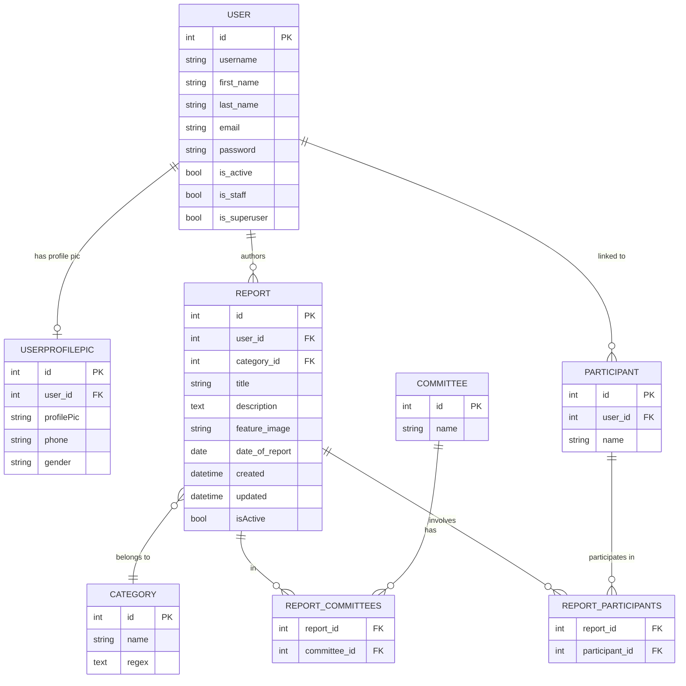
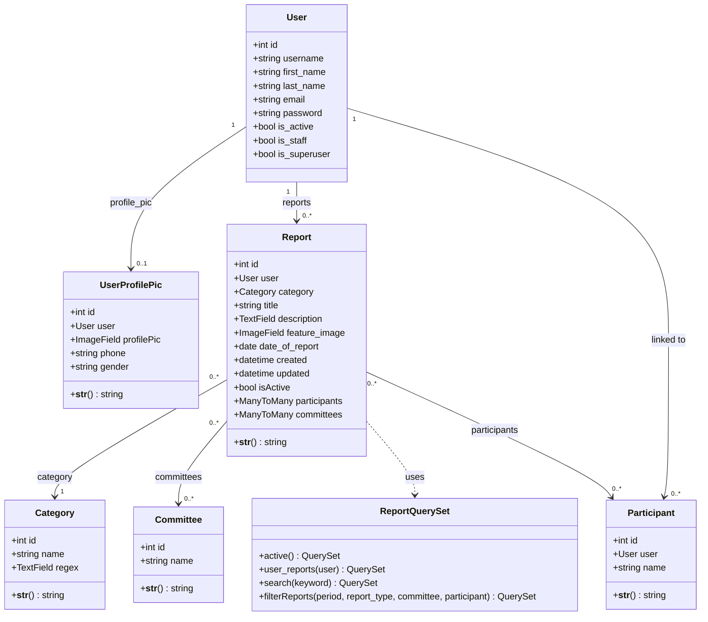
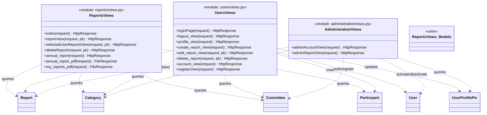

# SAR Platform — ERD & Class Diagrams

## Entity Relationship Diagram

---

## Class Diagram

### Models

### Views

---

## URL → View Mapping

| URL | View | App |
|-----|------|-----|
| `/reports/` | `index` | reports |
| `/reports/report/<pk>` | `reportView` | reports |
| `/reports/report/delete/<pk>` | `deleteReport` | reports |
| `/reports/annual-report/` | `annual_report` | reports |
| `/reports/annual/pdf/` | `annual_report_pdf` | reports |
| `/reports/my-reports/pdf/` | `my_reports_pdf` | reports |
| `/reports/reports/user/<pk>/` | `selectedUserReportsView` | reports |
| `/users/login/` | `loginPage` | users |
| `/users/logout/` | `logout_view` | users |
| `/users/profile/` | `profile_view` | users |
| `/users/profile/create-report` | `create_report_view` | users |
| `/users/profile/edit-report/<pk>` | `edit_report_view` | users |
| `/users/delete-report/<pk>` | `delete_report` | users |
| `/users/account/` | `account_view` | users |
| `/users/register/` | `registerView` | users |
| `/administration/admin-accounts/` | `adminAccountView` | administration |
| `/administration/admin-reports/` | `adminReportView` | administration |
